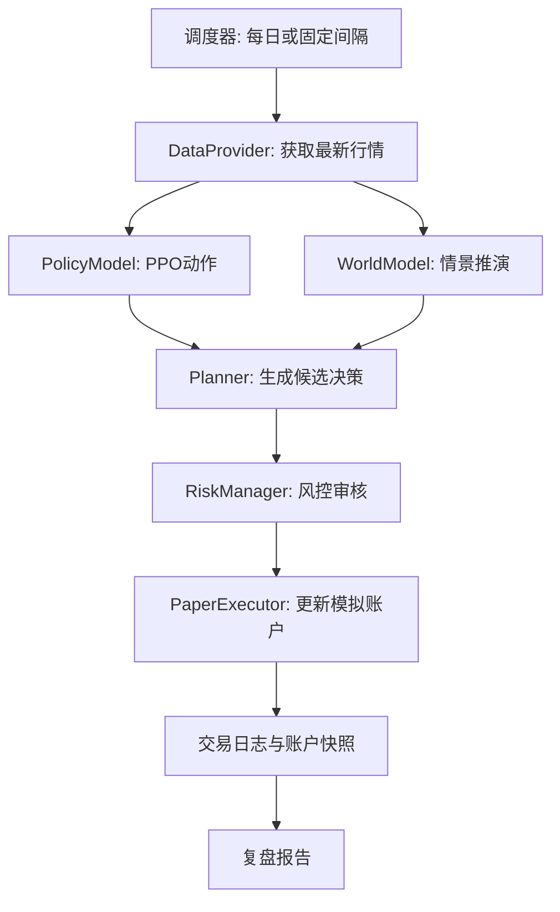

# 模拟盘设计

模拟盘是交易 Agent 从历史回测走向真实市场前的中间层。它使用接近实时的行情或每日收盘数据驱动 Agent 决策，但只更新本地模拟账户，不连接真实券商账户。

## 使用边界

- 只做 paper trading，不下真实订单。
- 所有订单写入本地日志，便于复盘。
- 所有动作必须经过 `RiskManager` 审核。
- 任何数据异常、模型异常或风控拒绝都应记录原因。

## 执行流程



## 账户状态

模拟账户至少记录：

- 初始资金
- 可用现金
- 当前持股数量
- 当前持仓成本
- 当前持仓市值
- 当前账户净值
- 历史最高净值
- 当前回撤

## 订单状态

模拟订单建议使用以下状态：

- `created`：Agent 生成了订单意图。
- `rejected`：风控拒绝执行。
- `filled`：模拟成交。
- `skipped`：行情不可交易或数据不足。
- `error`：执行过程中发生异常。

## 日志格式

建议每次模拟盘运行都写入 JSON Lines，便于追加和后续分析：

```json
{
  "timestamp": "2026-05-25T20:30:00",
  "date": "2019-12-10",
  "code": "sh.600036",
  "market": {
    "close": 36.25,
    "volume": 12345678
  },
  "policy_action": {
    "action_type": "buy",
    "amount": 0.2,
    "source": "ppo"
  },
  "planner_reason": "PPO suggests adding position; world model expected return is positive.",
  "risk_decision": {
    "approved": true,
    "triggered_rules": []
  },
  "execution": {
    "status": "filled",
    "fill_price": 36.27,
    "shares": 100,
    "fees": 5.0
  },
  "account": {
    "cash": 6370.0,
    "shares": 100,
    "net_worth": 9997.0,
    "drawdown": 0.003
  }
}
```

## 风控规则

第一版模拟盘建议至少包含：

- 禁止在停牌状态交易。
- 禁止买入超过可用现金。
- 禁止卖出超过持仓。
- 单次买入比例不超过配置上限。
- 总仓位不超过配置上限。
- 回撤超过阈值时只允许减仓或持有。
- 数据缺失或异常时拒绝交易。

## 运行方式

第一版可以做成每日手动运行：

```bash
python paper_trading.py --stock-code sh.600036 --model-path models/ppo_stock.zip
```

后续再加本地定时任务。定时任务只触发模拟盘，不连接真实交易接口。

## 复盘报告

模拟盘每次运行后应更新：

- `paper_trading/orders.jsonl`
- `paper_trading/account_curve.csv`
- `paper_trading/latest_report.md`

复盘报告应包含当日动作、拒绝原因、账户净值、累计收益、最大回撤和风险提示。
