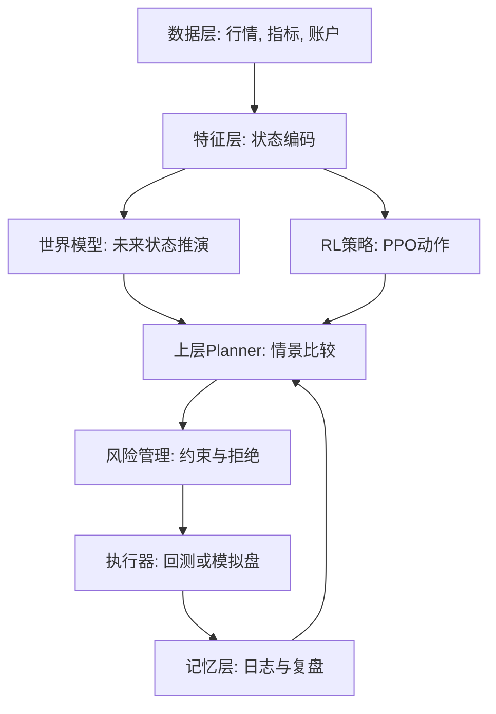
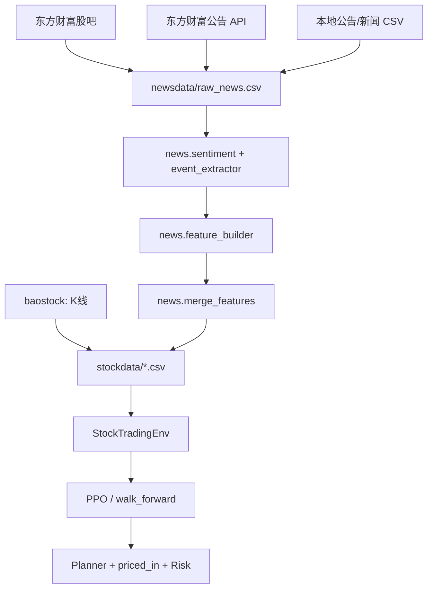

# 深度学习股票交易 Agent 系统设计

> 官方仓库：[ytq0198/Deep-Learning-Based-Stock-Trading-Agent-System](https://github.com/ytq0198/Deep-Learning-Based-Stock-Trading-Agent-System)  
> 参考原型：[ytq0198/RL-Stock](https://github.com/ytq0198/RL-Stock)

## 目录

- [官方仓库与定位](#官方仓库与定位)
- [项目结构](#项目结构)
- [目标](#目标)
- [总体流程](#总体流程)
- [数据设计](#数据设计)
- [环境设计](#环境设计)
  - [观测 Observation](#观测-observation)
  - [动作 Action](#动作-action)
  - [奖励 Reward](#奖励-reward)
- [模型设计](#模型设计)
- [风险与局限](#风险与局限)
- [后续改进方向](#后续改进方向)
- [多层交易 Agent 升级设计](#多层交易-agent-升级设计)
  - [模块数据流](#模块数据流)
  - [上层与下层分工](#上层与下层分工)
  - [模拟盘边界](#模拟盘边界)
- [新闻与行情双驱动设计](#新闻与行情双驱动设计)
  - [数据流](#数据流)
  - [新闻特征](#新闻特征)
  - [防止未来函数](#防止未来函数)
  - [使用边界](#使用边界)
- [阶段性演进评估](#阶段性演进评估)
  - [阶段一：基础 PPO 股票回测](#阶段一基础-ppo-股票回测)
  - [阶段二：交易 Agent 架构](#阶段二交易-agent-架构)
  - [阶段三：新闻与行情双驱动](#阶段三新闻与行情双驱动)
  - [阶段四：近期行情 + 近期舆情实验](#阶段四近期行情--近期舆情实验)
  - [阶段五：下一步正确验证方式](#阶段五下一步正确验证方式)
  - [阶段六：事件结构化与冷启动验证](#阶段六事件结构化与冷启动验证)
  - [阶段七：动态训练集与市场状态世界模型](#阶段七动态训练集与市场状态世界模型)
  - [阶段八：银行股事件增强与特征筛选优化](#阶段八银行股事件增强与特征筛选优化)
  - [阶段九：LLM 事件接口与 minimal_signal 风险评分](#阶段九llm-事件接口与-minimal_signal-风险评分)
  - [阶段十：精简特征与 Planner 仓位修正](#阶段十精简特征与-planner-仓位修正)
  - [阶段十一：强事件压力测试与进攻信号激活](#阶段十一强事件压力测试与进攻信号激活)
  - [阶段十二：真实公告源与 Price-in 判断](#阶段十二真实公告源与-price-in-判断)
  - [阶段十三：东方财富公告抓取接入](#阶段十三东方财富公告抓取接入)
  - [阶段十四：银行板块 Panel 数据扩充与滚动训测](#阶段十四银行板块-panel-数据扩充与滚动训测)
- [总体结论](#总体结论)
- [开源与复现说明](#开源与复现说明)

## 官方仓库与定位

本仓库 `Deep-Learning-Based-Stock-Trading-Agent-System` 是面向科研与毕业设计的**完整工程实现**，在 [RL-Stock](https://github.com/ytq0198/RL-Stock) 的 PPO 炒股思路上，逐步升级为「多层 Agent + 新闻/公告/事件 + 动态回测」系统。

与原始 RL-Stock 仓库的关系：

| 维度 | RL-Stock（参考） | 本仓库（当前） |
|------|------------------|----------------|
| 算法 | PPO + 单环境 | PPO + walk-forward + Agent 分层 |
| 数据 | baostock K 线 | K 线 + 股吧 + 公告 + 事件特征 |
| 决策 | 模型直接输出动作 | PPO → Planner → Risk → Executor |
| 验证 | 单次训练/测试 | 相关性、基线 ML、滚动回测 |
| 目标 | 跑通强化学习流程 | 可解释、可诊断的研究型 Agent |

**当前版本能力边界**：代码闭环完整，交易有效性尚未被统计证明；适合学习、实验与论文原型，**不构成投资建议**。

## 项目结构

```text
Deep-Learning-Based-Stock-Trading-Agent-System/
├── main.py                 # PPO 训练与评估入口
├── get_stock_data.py       # baostock 行情下载
├── news_pipeline.py        # 新闻/公告采集与特征融合
├── walk_forward.py         # 滚动窗口动态训练回测
├── market_regime.py        # 市场状态聚类特征
├── priced_in_analyzer.py   # 利好是否已兑现（price-in）
├── feature_baseline.py       # 传统 ML 特征冷启动验证
├── feature_selection.py    # 特征组合自动筛选
├── sentiment_correlation.py
├── agent_backtest.py       # 多层 Agent 回测
├── paper_trading.py        # 单步模拟盘决策
├── rlenv/                  # Gymnasium 交易环境
├── agent/                  # Data / Policy / WorldModel / Planner / Risk / Executor
├── news/                   # 爬虫、情绪、事件、公告、特征合并
│   ├── announcement.py     # 公告接口 + 东方财富公告爬虫
│   ├── crawler.py          # 股吧、RSS、CSV
│   └── event_extractor.py  # 规则/LLM 事件抽取
├── docs/                   # 实验与接口说明
├── 项目设计.md             # 本文件：架构与阶段演进
└── README.md               # 快速上手指南
```

运行时生成目录（默认不纳入 Git）：`stockdata/`、`stockdata_*`、`newsdata/*.csv`、`models/`、`img/`、`reports/`。

## 目标

本项目在 [RL-Stock](https://github.com/ytq0198/RL-Stock) 基础上，于官方仓库 [Deep-Learning-Based-Stock-Trading-Agent-System](https://github.com/ytq0198/Deep-Learning-Based-Stock-Trading-Agent-System) 持续演进。核心目标不是直接给出真实交易信号，而是搭建可复现实验流程：下载股票数据、融合新闻与公告、构建强化学习环境、训练 PPO 策略、经 Planner/风控层决策，并在测试集与 walk-forward 回测中输出可诊断结果。

## 总体流程

1. 使用 `baostock` 下载 A 股日线行情数据，保存为 CSV。
2. 将历史数据划分为训练集和测试集。
3. 将单只股票的行情数据封装成 `gymnasium.Env` 环境。
4. 使用 PPO 策略网络根据环境观测输出交易动作。
5. 在测试集上执行模型动作，记录每日利润并生成曲线图。

## 数据设计

数据来源沿用原仓库介绍中的 baostock。默认下载字段包括：

- 行情字段：`open`、`high`、`low`、`close`、`preclose`、`volume`、`amount`
- 状态字段：`adjustflag`、`turn`、`tradestatus`、`pctChg`、`isST`
- 基本面字段：`peTTM`、`pbMRQ`、`psTTM`、`pcfNcfTTM`

默认训练和测试时间段与原项目一致：

- 训练集：`1990-01-01` 到 `2019-11-29`
- 测试集：`2019-12-01` 到 `2019-12-31`

为了便于没有网络或没有 baostock 数据时验证流程，`main.py` 提供 `--make-demo-data` 参数生成合成演示数据。演示数据只用于跑通代码，不用于策略有效性判断。

## 环境设计

自定义环境位于 `rlenv/StockTradingEnv0.py`，继承 `gymnasium.Env`。

### 观测 Observation

观测由两部分组成：

- 股票市场特征：开盘价、最高价、最低价、收盘价、成交量、成交金额、换手率、涨跌幅、市盈率等。
- 账户状态特征：现金余额、历史最大净值、当前持股数、持仓成本、累计卖出数量、累计卖出金额。

由于不同字段量纲差异很大，环境会按预设比例缩放并裁剪到 `[-1, 1]`，降低神经网络训练难度。

### 动作 Action

动作是长度为 2 的连续数组：

- `action[0]`：动作类型，取值范围 `[1, 3]`。
- `action[1]`：买入或卖出比例，取值范围 `[0, 1]`。

动作解释：

- `action[0] < 1.5`：买入，用 `action[1]` 表示使用多少现金买入。
- `1.5 <= action[0] < 2.5`：卖出，用 `action[1]` 表示卖出当前持仓的比例。
- `action[0] >= 2.5`：保持，不交易。

这样既保留原 README 中“买入、卖出、保持”的设计，又适配 PPO 对连续动作空间的使用方式。

### 奖励 Reward

项目提供两种奖励策略：

- `profit_sign`：贴近原仓库介绍，当前账户盈利时给 `1`，否则给 `-100`。
- `profit_delta`：使用本步净值变化率作为奖励，适合后续做更稳定的训练实验。

默认策略是 `profit_sign`，以符合原仓库介绍。实际研究中建议比较两种奖励策略的结果，因为过大的亏损惩罚可能让策略更保守，也可能导致训练不稳定。

## 模型设计

训练入口位于 `main.py`，使用 `stable-baselines3` 的 PPO：

- 策略网络：`MlpPolicy`
- 环境包装：`DummyVecEnv`
- 默认训练步数：`10000`
- 模型输出：`models/ppo_stock.zip`
- 收益图输出：`img/<股票代码>.png`

原仓库依赖 `stable-baselines` 和 TensorFlow 1.x。该组合在现代 Windows/Python 环境中安装困难，因此本项目升级为 `stable-baselines3`、`gymnasium` 和 PyTorch 生态，保留算法和环境思路。

## 风险与局限

1. 当前环境只模拟单只股票，未考虑多股票组合、仓位约束、滑点、手续费、涨跌停、停牌不可交易等真实市场限制。
2. 测试集默认只有一个月，样本太短，不能说明策略长期有效。
3. PPO 在金融时间序列上容易过拟合，需要滚动验证、更多年份测试和基准策略对比。
4. baostock 数据适合学习和研究，不应直接作为实盘系统唯一数据源。
5. 本项目只用于科研和课程实验，不构成投资建议。

## 后续改进方向

1. 加入手续费、滑点、最小交易单位和涨跌停规则。
2. 增加买入并持有、均线策略等基准策略对比。
3. 支持多只股票组合训练，输出整体收益率、最大回撤和夏普比率。
4. 使用滚动窗口交叉验证，降低单一时间段偶然性。
5. 增加训练日志、模型评估报告和参数配置文件。

## 多层交易 Agent 升级设计

当前项目是一个单模型 PPO 回测程序。升级为交易 Agent 后，系统不再只回答“模型下一步买还是卖”，而是形成“数据理解、市场模拟、策略决策、风险审核、模拟执行、复盘记忆”的闭环。

推荐分层如下：

1. 数据层：统一读取历史 CSV、baostock 下载数据和后续模拟盘行情。
2. 特征层：将行情、技术指标和账户状态转换为模型可读的结构化状态。
3. 世界模型层：根据当前状态和候选动作，模拟未来价格、收益或风险分布。
4. 下层 RL 策略层：使用 PPO 等强化学习模型快速输出买入、卖出、持有及比例。
5. 上层推理层：用规则或 LLM 分析 PPO 动作、世界模型推演结果和风险指标，给出可解释决策。
6. 风险管理层：独立检查仓位、回撤、止损、数据异常和禁止交易规则。
7. 执行层：先做历史回测和 paper trading，不直接连接真实交易账户。
8. 记忆层：记录交易动作、拒绝原因、账户变化、收益曲线和复盘结论。

### 模块数据流



### 上层与下层分工

LLM 不适合作为毫秒级交易反应模型，也不应该直接下单。它更适合在上层做解释、计划和风险复核，例如回答“为什么今天不交易”“PPO 的建议是否违反仓位约束”“世界模型推演中最差情景是什么”。

下层 PPO 模型负责快速动作输出；世界模型负责推演不同未来路径；风险管理层负责最终放行或拒绝。这样的结构更容易回测、解释和逐步验证。

### 模拟盘边界

本项目后续目标是 paper trading，也就是模拟盘。模拟盘允许 Agent 按当天行情生成交易指令并记录账户变化，但不连接真实券商账户。只有当长期模拟盘结果稳定、风险控制完备、人工复核流程明确之后，才可以讨论真实交易接口。

## 新闻与行情双驱动设计

只使用历史 K 线训练容易陷入“后视镜开车”：模型只能看到价格和成交量已经发生的变化，无法感知公告、新闻、政策和舆情这些增量信息。因此项目新增 `news/` 模块，把非结构化文本转换成可训练的数值特征。

### 数据流



公告数据源（阶段十三）：

- 接口：`AnnouncementCrawler`（`news/announcement.py`）
- 实现：`EastmoneyAnnouncementCrawler`（东方财富公告中心 API）
- 命令：`python news_pipeline.py --announcements --announcement-start 2019-01-01 --announcement-end 2019-12-31`
- 可与 `--guba` 合并：公告作主信号，股吧作 `social_heat` 热度指标

### 新闻特征

每日新闻会被聚合成以下字段：

- `news_count`：当天可用新闻数量。
- `sentiment_mean`：平均情绪分，范围约为 `[-1, 1]`。
- `sentiment_max`：最强正面情绪。
- `sentiment_min`：最强负面情绪。
- `positive_count`：正面新闻数量。
- `negative_count`：负面新闻数量。
- `announcement_score`：公告类新闻影响强度。
- `social_heat`：新闻/讨论热度相对近几日均值的倍数。

同时为了处理“利好出尽是利空”，融合流程还会生成：

- `pre_3d_return`
- `pre_5d_return`
- `pre_20d_return`
- `volume_spike`

这些特征帮助模型判断新闻出现前价格是否已经提前反应。

### 防止未来函数

新闻特征默认会后移一天。也就是说，某天收集到的新闻不会直接用于当天交易，而是作为下一天可用信息。这是为了避免训练时偷看未来，导致回测结果虚高。

如果明确做收盘后决策或研究实验，可以通过 `news_pipeline.py --no-shift` 关闭后移，但正式回测不建议这样做。

### 使用边界

当前新闻情绪打分使用规则词典，适合作为无 API 的最小闭环。后续可以把 `RuleBasedSentimentScorer` 替换为 LLM 打分器，但 LLM 仍只负责“文本结构化”，不直接下单。

## 阶段性演进评估

本项目不是一次性完成的“炒股机器人”，而是分阶段从基础强化学习实验逐步升级为多源交易 Agent。每个阶段都有其正确性，也都有明显漏洞。下面按阶段说明。

### 阶段一：基础 PPO 股票回测

这一阶段的目标是复现 RL-Stock 的核心思想：用历史行情训练 PPO，让模型在测试集上输出买入、卖出或持有动作。

系统正确性：

1. 数据流完整：`get_stock_data.py` 可以下载股票 CSV，`main.py` 可以读取训练集和测试集。
2. 环境可运行：`StockTradingEnv` 实现了 observation、action、reward、reset、step。
3. 模型可训练：`stable-baselines3` 的 PPO 能正常训练并输出收益曲线。
4. 测试闭环存在：训练后会保存模型和收益图，能够观察测试集结果。

主要漏洞：

1. 原始奖励函数过粗糙，`profit_sign` 只区分盈利和亏损，不关心盈利幅度。
2. 测试集太短时，单次收益不能证明策略有效。
3. 金融时间序列非平稳，单只股票训练容易过拟合。
4. 初期环境没有手续费、滑点、整手交易等真实约束，收益可能被高估。
5. PPO 输出连续动作时可能出现 `buy 0.0`，导致看似训练完成但实际没有成交。

当前处理：

1. 增加了 `profit_delta` 奖励策略。
2. 增加了手续费、滑点、最小交易比例、整手交易和仓位约束。
3. 在 `main.py` 中打印实际使用的数据文件和有效交易次数，避免误判。

### 阶段二：交易 Agent 架构

这一阶段把单一 PPO 模型升级为多层 Agent：下层 PPO 负责快速反应，上层 Planner 负责解释和推演，RiskManager 负责风控，Executor 负责回测或模拟盘执行。

系统正确性：

1. 模块边界更清晰：`DataProvider`、`PolicyModel`、`WorldModel`、`Planner`、`RiskManager`、`Executor` 各自职责明确。
2. 风险控制独立于模型：即使 PPO 输出买入，风控层仍可以拒绝。
3. 执行结果可追踪：Agent 回测会输出 `trades.csv`、`equity_curve.csv` 和报告。
4. LLM 不直接下单，避免语言模型幻觉直接影响交易。

主要漏洞：

1. 当前 Planner 仍是规则版，不是真正复杂推理。
2. 世界模型只是历史收益 bootstrap，并没有真正学习市场状态转移。
3. Agent 回测和 PPO 训练环境还不是完全同一个执行逻辑，可能出现训练和评估约束不一致。
4. 风控规则仍然简单，没有行业风险、组合风险、资金流风险等更复杂约束。

当前处理：

1. 保持所有模块接口清晰，便于后续替换成更强模型。
2. 把真实交易接口排除在外，只支持回测和 paper trading。
3. 用 `docs/agent_interfaces.md`、`docs/backtest_upgrade.md` 和 `docs/paper_trading.md` 记录边界。

### 阶段三：新闻与行情双驱动

这一阶段新增 `news/` 模块，把新闻、公告、股吧帖子等非结构化文本转成每日情绪特征，再和 K 线合并训练。

系统正确性：

1. 数据融合链路完整：新闻采集、情绪打分、日聚合、合并 K 线、训练 PPO 全部打通。
2. observation 已扩展：环境可以读取 `sentiment_mean`、`news_count`、`announcement_score`、`social_heat` 等特征。
3. 防未来函数：新闻特征默认后移一天，避免当天新闻被当天交易偷看。
4. 增加价格上下文：`pre_3d_return`、`pre_5d_return`、`pre_20d_return`、`volume_spike` 用于处理“利好出尽是利空”。

主要漏洞：

1. 规则词典情绪打分较粗糙，无法理解反讽、上下文和复杂公告。
2. 新闻标题和股吧帖子噪声很大，未必能稳定预测股价。
3. 如果新闻覆盖率低，大部分日期新闻特征为 0，模型学不到有效规律。
4. 演示新闻不能证明真实有效，只能证明工程流程可运行。

当前处理：

1. 增加 `sentiment_quality.json`，检查训练集和测试集新闻覆盖率。
2. 增加 `compare_experiment.py`，用同一随机种子比较无新闻和新闻融合模型。
3. 明确 LLM 未来只用于文本结构化，不直接输出交易指令。

### 阶段四：近期行情 + 近期舆情实验

由于当前可抓取的东方财富股吧数据主要集中在 2026 年近期，因此项目从旧的 2018-2019 区间切换到近期行情窗口。

系统正确性：

1. 近期行情已通过 baostock 下载，形成 `stockdata_recent`。
2. 股吧公开列表可抓取真实帖子标题，形成 `guba_news.csv`。
3. 近期行情与近期舆情可以合并，形成 `stockdata_recent_guba_sentiment`。
4. 后续又重新切分了更均衡的 `stockdata_recent_balanced` 和 `stockdata_recent_balanced_guba_sentiment`。

实验现象：

1. 初始近期切分中，训练集新闻覆盖率约 `2.5%`，测试集约 `78.6%`，两者严重不均衡。
2. 均衡切分后，训练集新闻覆盖率约 `10%`，测试集约 `32%`，差距有所缩小。
3. 在均衡数据上，无新闻模型和新闻融合模型结果完全一致，均为 `Final profit: -608.03`。

主要漏洞：

1. 训练集只有约 30 个交易日，样本太短。
2. 训练集新闻覆盖率虽然提升到 `10%`，但仍只有 3 个交易日有新闻。
3. 股吧舆情质量不稳定，帖子标题可能更多反映散户情绪，而不是可交易信息。
4. 当前 PPO 在短窗口上容易学到相同策略，新闻特征没有发挥增量作用。

阶段结论：

1. “近期行情 + 近期舆情”的工程流程是正确的。
2. 当前数据规模不足以证明新闻特征有效。
3. 继续加训练步数意义不大，应该先验证新闻特征与次日涨跌是否存在相关性。

### 阶段五：下一步正确验证方式

在继续强化学习之前，应先做更基础的统计验证：新闻特征本身是否与未来收益有关。

推荐验证：

1. 计算 `sentiment_mean` 与下一交易日 `pctChg` 的相关系数。
2. 计算 `news_count`、`negative_count`、`social_heat` 与未来 1 日、3 日、5 日收益的相关性。
3. 画散点图和分组收益图，例如高情绪日、低情绪日、中性日之后的平均涨跌。
4. 对比公告类新闻和股吧讨论类新闻，不要混在一起判断。
5. 只有当新闻特征本身有统计信号后，再把它喂给 PPO。

当前系统漏洞：

1. 缺少新闻特征相关性分析脚本。
2. 缺少多股票、多时间段滚动验证。
3. 缺少 LLM 情绪打分器，当前规则词典表达能力不足。
4. 缺少真实公告源，如巨潮资讯或交易所公告。
5. 缺少更严谨的基准策略和显著性检验。

下一阶段目标：

1. 新增新闻特征相关性分析。
2. 扩大股票池，不只看 `sh.600036`。
3. 增加真实公告和财经新闻源。
4. 将 LLM 用作文本结构化工具，输出情绪、事件类型、影响方向、影响期限。
5. 在统计信号成立后，再训练新闻增强 PPO 或世界模型。

当前已补充：

1. `sentiment_correlation.py`：用于计算新闻特征与未来 1/3/5 日收益的相关系数。
2. `correlations.csv`：保存各特征与未来收益的相关性。
3. `grouped_returns.csv`：保存按情绪或热度分组后的未来平均收益。
4. `sentiment_vs_future_1d.png`：展示情绪分和次日收益的散点关系。
5. `sentiment_group_returns.png`：展示正面、中性、负面情绪组的次日平均收益。
6. `news/event_extractor.py`：将新闻文本从一维情绪分升级为事件类型、影响方向、置信度和影响期限。
7. `feature_baseline.py`：用逻辑回归和随机森林验证价格、情绪、事件特征是否能预测次日涨跌。

新的验证顺序应为：

1. 先运行 `news_pipeline.py` 构建新闻融合数据。
2. 再运行 `sentiment_correlation.py` 验证新闻特征是否有线性或分组信号。
3. 继续运行 `feature_baseline.py`，用传统模型判断特征能否预测次日涨跌。
4. 如果相关性和传统模型都接近随机，不应急着训练 PPO，而应改进新闻源或情绪打分。
5. 如果某些新闻/事件特征对未来收益有稳定方向，再进入 PPO 或 Agent 训练。

### 阶段六：事件结构化与冷启动验证

这一阶段的目标是把文本特征从“情绪分”升级为“事件特征”，并在强化学习前使用传统机器学习做冷启动验证。

系统正确性：

1. 事件抽取器会把新闻文本映射为 `event_type`、`impact_direction`、`impact_duration_days` 和 `confidence_score`。
2. 每日聚合后会生成 `event_count`、`event_positive_count`、`event_negative_count`、`event_risk_count`、`event_confidence_mean`、`event_duration_mean`。
3. 这些事件特征会进入融合后的行情 CSV，并被 `StockTradingEnv` 读取。
4. `feature_baseline.py` 会在训练集和测试集上分别训练、验证逻辑回归和随机森林。

主要漏洞：

1. 当前事件抽取仍是规则版，不如 LLM 能理解上下文、反讽和复杂公告。
2. 单只股票样本太少，传统模型结果也可能不稳定。
3. 如果测试期只有少数上涨/下跌样本，准确率会有明显偶然性。
4. 事件特征是否有效，仍需要多股票、多时间段验证。

阶段判断标准：

1. 如果 `feature_baseline.py` 的准确率长期低于 `52%`，说明当前特征不适合进入 PPO。
2. 如果 `event` 或 `full` 特征集明显优于 `price_only`，说明文本事件特征可能提供增量信息。
3. 如果随机森林显著优于逻辑回归，说明特征可能存在非线性关系。

当前优化：

1. 已扩展银行股专用事件词典，覆盖资产质量、净息差、财富管理、资本充足率、监管处罚、政策支持、估值修复、高股息等事件。
2. 已新增 `feature_selection.py`，自动比较 `price_only`、`sentiment_light`、`event`、`regime`、`sentiment_event`、`event_regime`、`full`、`minimal_signal` 等多组特征。
3. 特征选择结果按 AUC 和 Accuracy 排序，用于决定哪些特征应进入 PPO，哪些特征应剔除。
4. 如果精简特征优于 full 特征，说明全量特征中存在噪声，应优先使用精简组合训练。

当前筛选结果：

1. 最优组合是 `minimal_signal + random_forest`。
2. 最优特征为 `pre_5d_return`、`volume_spike`、`social_heat`、`event_risk_count`、`regime_code`。
3. 该组合测试集 Accuracy 为 `45.83%`，AUC 为 `0.7938`。
4. 全量特征 `full + random_forest` 的 AUC 只有 `0.5750`，说明全量特征中存在明显噪声。
5. 纯价格特征 `price_only + random_forest` 的 AUC 只有 `0.4500`，说明情绪/事件/regime 组合确实提供了某种排序信号。

阶段结论：

1. 不应把所有新闻字段直接喂给 PPO。
2. 下一轮强化学习应优先使用 `minimal_signal` 特征集。
3. 由于 Accuracy 仍低于 `52%`，该信号更适合用于“过滤交易/排序风险”，暂不适合直接作为强买卖信号。
4. `social_heat` 和 `event_risk_count` 更像风险过滤器，而不是无脑买入信号。

### 阶段七：动态训练集与市场状态世界模型

这一阶段针对金融市场的非平稳性和概念漂移问题。核心思想是：长期历史不直接训练交易动作，而是用于识别市场状态；短期窗口用于动态训练和 walk-forward 回测。

系统设计：

1. 长期记忆：`market_regime.py` 从较长历史数据中提取收益率、波动率、换手率、成交量异动、回撤、情绪和事件风险等特征。
2. 市场状态：使用 KMeans 聚类生成 `regime_code`，并展开为 `regime_0`、`regime_1`、`regime_2`、`regime_3`。
3. 短期记忆：`DynamicDataProvider` 按 rolling window 切出最近 N 天训练集和未来 M 天测试集。
4. 动态回测：`walk_forward.py` 每个窗口重新训练 PPO，并只测试窗口后的短期行情。

系统正确性：

1. 它不再假设 2018 年、2020 年、2026 年的市场规律相同。
2. 它让长期数据承担“识别市场环境”的任务，而不是直接混入短期交易策略。
3. 它让短期 PPO 更贴近测试集分布，减少旧规律污染。
4. 它比一次性 train/test split 更接近真实量化研究中的 walk-forward backtesting。

主要漏洞：

1. 当前市场状态分类器使用 KMeans，状态含义需要人工解释。
2. 当前样本仍然较少，聚类结果可能不稳定。
3. Walk-forward 每个窗口都重新训练 PPO，计算成本更高。
4. 如果每个窗口太短，PPO 可能无法充分学习；如果窗口太长，又会引入旧规律。
5. 当前 regime 特征只是世界模型雏形，还不是生成式市场模拟器。
6. 动态训练并不自动等于更好交易；如果每个窗口都交易，手续费和滑点会持续侵蚀净值。

当前已补充的风控过滤：

1. 弱信号过滤：当 PPO 输出的交易比例低于 `action_threshold` 时转为空仓。
2. 边界过滤：当动作类型靠近买/卖/持有分界线时，认为模型不确定，转为空仓。
3. Regime-aware 风控：当市场状态被识别为高风险 regime 时，阻止买入。
4. Walk-forward 报告会记录原始动作、过滤原因、是否实际成交和当前 `regime_code`。

验证结果：

1. 未启用过滤时，小规模 walk-forward 共 5 个窗口，5 个窗口全部发生交易，最终净值为 `9972.45`，总收益为 `-27.55`。
2. 启用弱信号过滤和自动高风险 regime 过滤后，同样 5 个窗口全部被过滤为空仓，最终净值为 `10000.00`，总收益为 `0.00`。
3. 过滤原因均为 `weak_amount`，说明 PPO 输出的方向偏买入，但动作比例只有约 `0.06` 到 `0.12`，属于弱信号。
4. 这说明前一轮亏损主要来自“弱信号也被强制交易”带来的手续费和滑点损耗，而不是模型捕捉到明确负收益机会。

阶段结论：

1. 动态训练链路是正确的，但不能让 PPO 的所有微弱动作都进入执行层。
2. 风控过滤器是 walk-forward 系统的必要组成部分，不是可选优化。
3. 当前模型更像“方向有一点倾向但信心不足”，因此合理行为应是空仓等待，而不是强行交易。
4. 下一步应继续改进信号强度，而不是降低过滤阈值去追求更多交易。

阶段判断标准：

1. 如果 walk-forward 的净值曲线比固定训练集更稳定，说明动态训练有价值。
2. 如果某些 regime 下策略总是亏损，说明需要加入 regime-aware 风控。
3. 如果 regime 切换前后收益显著变化，说明市场状态特征对 Agent 有解释价值。
4. 如果动态训练仍然不优于买入持有或空仓，说明 PPO 策略本身还不成熟。

后续升级方向：

1. 用 HMM、VAE 或 Transformer Encoder 替换 KMeans，学习更复杂的市场隐状态。
2. 将 regime 状态输入 Planner，用于调整仓位上限和风险阈值。
3. 将历史相似 regime 的后续走势作为世界模型推演样本。
4. 在 paper trading 中每日收盘后更新最近窗口，实现在线微调。

### 阶段八：银行股事件增强与特征筛选优化

这一阶段的目标是解决阶段六和阶段七暴露出的一个核心问题：特征太多、噪声太大，PPO 接收到的状态虽然丰富，但有效信号被大量弱特征稀释。因此，本阶段不继续盲目增加模型复杂度，而是先优化事件抽取和特征筛选。

本阶段做了哪些更新：

1. 扩展了 `news/event_extractor.py`，新增银行股专用事件词典。
2. 事件类型从通用的“利好/利空”扩展为更贴近银行股业务的结构化事件。
3. 新增了 `feature_selection.py`，自动比较多组特征组合的预测能力。
4. 重新生成了事件融合数据和 regime 数据。
5. 将筛选结果写入 `reports/feature_selection/`，用于决定后续 PPO 应使用哪些特征。

银行股专用事件包括：

1. 资产质量改善或恶化。
2. 净息差改善或收窄。
3. 财富管理和中间收入变化。
4. 资本充足率变化。
5. 监管处罚和合规风险。
6. 政策支持或政策压力。
7. 高股息、估值修复和拥挤交易。
8. 市场恐慌和股吧高热度讨论。

本阶段的系统正确性：

1. 文本不再只被压缩成一个 `sentiment_mean`，而是被拆成更有业务含义的事件特征。
2. 特征筛选不再凭主观判断，而是通过逻辑回归和随机森林做冷启动验证。
3. 系统可以比较 `price_only`、`sentiment_light`、`event`、`regime`、`event_regime`、`full`、`minimal_signal` 等不同特征组合。
4. 这个阶段把“该不该把特征喂给 PPO”前置为一个可验证问题，而不是直接进入强化学习。

本阶段获得的效果：

最新特征筛选显示，最优组合不是 `full`，而是更精简的 `minimal_signal`：

```text
pre_5d_return
volume_spike
social_heat
event_risk_count
regime_code
```

该组合在当前测试中达到：

```text
Accuracy: 45.83%
AUC: 0.7938
```

对比结果如下：

```text
price_only + random_forest: AUC 0.4500
full + random_forest: AUC 0.5750
minimal_signal + random_forest: AUC 0.7938
```

这说明：

1. 纯价格特征在当前样本中预测能力较弱。
2. 全量特征并不最优，说明其中存在噪声。
3. 精简后的 `minimal_signal` 更能保留有效排序信号。
4. `social_heat`、`event_risk_count` 和 `regime_code` 可能比普通情绪均值更有价值。

本阶段和阶段七的连接：

阶段七中，walk-forward 验证发现 PPO 输出的是弱买入信号，强制执行会造成手续费和滑点损耗：

```text
无过滤：最终净值 9972.45，交易 5 次
有过滤：最终净值 10000.00，交易 0 次
```

阶段八进一步解释了为什么会出现这种情况：模型看到的全量特征过多且噪声较大，导致 PPO 无法形成强动作，只能输出 `0.06` 到 `0.12` 左右的弱买入比例。因此，下一轮 PPO 不应该继续使用 full 特征，而应优先使用 `minimal_signal` 或将其作为 Planner/RiskManager 的过滤依据。

本阶段面临的困局：

第一，信号有排序能力，但还没有形成可交易的强方向。`minimal_signal` 的 AUC 达到 `0.7938`，说明它可能能区分“相对更好”和“相对更差”的样本；但 Accuracy 只有 `45.83%`，说明它还不能稳定判断明天涨跌。

这意味着当前特征更适合用于：

1. 风险过滤。
2. 降低仓位。
3. 排除高风险交易。
4. 给 Planner 提供上下文。

而不适合直接作为：

1. 强买入信号。
2. 满仓交易信号。
3. PPO 无条件执行信号。

第二，样本量仍然太小。当前均衡数据只有几十个交易日，训练样本和测试样本都不够。金融数据噪声极大，在这种样本量下，即使 AUC 看起来较高，也可能是偶然结果。

第三，新闻源仍然偏弱。东方财富股吧能提供真实舆情热度，但股吧标题噪声大，更多反映散户情绪，不一定代表真正的信息增量。更高质量的数据源应该是：

1. 公司公告。
2. 财报。
3. 监管公告。
4. 主流财经新闻。
5. 行业政策。

第四，事件抽取仍然是规则版。虽然已经加入银行股专用词典，但它仍然无法理解复杂语义，例如：

1. 反讽。
2. 利好出尽。
3. 市场预期是否已经提前兑现。
4. 行业链传导。
5. 公告中隐藏的负面细节。

第五，PPO 当前并没有学出强策略。它输出的交易方向有时偏买入，但动作比例很小，经常被过滤为 `weak_amount`。这说明 PPO 对当前状态没有足够信心。

本阶段结论：

本项目已经完成“工程闭环”和“研究诊断闭环”，但还没有完成“可交易信号闭环”。

也就是说：

```text
能采集数据 -> 能构造特征 -> 能训练模型 -> 能回测 -> 能诊断问题
```

这一条已经成立。

但：

```text
特征稳定预测收益 -> 模型稳定产生强信号 -> 策略长期跑赢基准
```

这一条还没有成立。

下一步突破口：

第一，扩大数据规模。至少需要覆盖数百个交易日，并让新闻覆盖率在训练集和测试集中都达到较高水平。

第二，引入更高质量文本源。股吧只能作为舆情热度指标，真正的事件信号应来自公告、财报、监管和财经新闻。

第三，引入 LLM 事件抽取。LLM 不直接下单，而是输出结构化事件：

```json
{
  "event_type": "asset_quality_negative",
  "impact_direction": "negative",
  "impact_duration_days": 20,
  "confidence_score": 0.82,
  "is_priced_in": true
}
```

第四，把 `minimal_signal` 用作风控和仓位调节，而不是直接买卖。例如：

1. `social_heat` 过高且 `event_risk_count` 上升时降低仓位。
2. 高风险 `regime_code` 中禁止加仓。
3. 只有当 PPO 动作强度和特征信号同时满足阈值时才交易。

第五，继续完善世界模型。当前 KMeans regime 是世界模型雏形，后续可以升级为 HMM、VAE 或 Transformer Encoder，学习更稳定的市场隐状态。

### 阶段九：LLM 事件接口与 minimal_signal 风险评分

这一阶段把阶段八得到的结论落到执行层：既然 `minimal_signal` 更适合做风险过滤，而不是直接做买卖信号，那么它应该进入 `RiskManager`，控制 PPO 动作是否允许执行。

本阶段做了哪些更新：

1. 新增 `LLMEventExtractor` 接口，未来可以接入任意大模型 API。
2. 当前没有 LLM API 时，`LLMEventExtractor` 会自动回退到 `RuleBasedEventExtractor`。
3. 新增 `RiskSignalScorer`，基于 `minimal_signal` 计算风险分。
4. 将风险分接入 `walk_forward.py`，通过 `--use-risk-signal` 启用。
5. Walk-forward 报告会记录 `risk_score`，方便观察风控为何拦截交易。

风险评分使用的核心字段：

```text
pre_5d_return
volume_spike
social_heat
event_risk_count
regime_code
```

系统正确性：

1. LLM 不直接下单，只负责未来的文本结构化。
2. PPO 不再拥有最终执行权，所有动作都要经过风险分过滤。
3. `minimal_signal` 被用于它更适合的位置：风险识别和交易许可，而不是直接生成买卖动作。
4. 风险分与过滤原因会进入报告，避免黑箱执行。

验证结果：

1. 使用 `--use-risk-signal` 运行 5 个 walk-forward 窗口，系统成功记录了 `risk_score`。
2. 这 5 个窗口的平均风险分为 `0.0000`，说明当前窗口没有触发 `social_heat`、`event_risk_count` 或高风险 `regime` 条件。
3. 在只启用风险评分、关闭弱信号过滤时，最终净值仍为 `9972.45`，说明亏损仍来自弱买入动作产生的手续费和滑点。
4. 因此，`RiskSignalScorer` 负责拦截高风险场景，`action_threshold` 和 `boundary_margin` 负责拦截弱信号，两者需要同时使用。

最新 walk-forward 结果：

使用以下命令运行 10 个动态训练窗口：

```bash
python walk_forward.py --data-dir stockdata_recent_regime --stock-code sh.600036 --use-risk-signal --auto-block-risk-regimes --action-threshold 0.2 --boundary-margin 0.08
```

结果为：

```text
窗口数：10
最终净值：10000.00
有效交易窗口数：0
过滤为空仓窗口数：10
平均风险分：0.0000
```

逐窗口诊断显示：

```text
filter_reason = weak_amount
risk_score = 0.0
raw_action_type = 1.0
raw_amount = 0.00 ~ 0.14
```

这说明当前 PPO 总体倾向买入，但买入比例低于 `action_threshold=0.2`，属于弱信号，因此全部被过滤为空仓。当前主要问题不是风险分过高，而是 PPO 动作强度不足。

推荐运行方式：

```bash
python walk_forward.py --data-dir stockdata_recent_regime --stock-code sh.600036 --use-risk-signal --auto-block-risk-regimes --action-threshold 0.2 --boundary-margin 0.08
```

当前局限：

1. `RiskSignalScorer` 仍然是规则评分器，阈值需要更多数据校准。
2. `LLMEventExtractor` 目前只是接口和 fallback，还没有接入真实 LLM API。
3. 风险分只能阻止风险交易，还不能创造强交易信号。
4. 如果 PPO 本身动作长期很弱，风险评分器不能解决信号不足问题，仍需要弱信号过滤器让系统空仓等待。
5. 当前风险分在部分窗口为 0，说明 `minimal_signal` 风险规则还需要更多数据和更细阈值校准。
6. 当前 PPO 的原始动作虽然偏买入，但 `raw_amount` 普遍低于 `0.2`，说明策略仍然缺乏足够置信度。

阶段结论：

这一阶段把系统从“模型给动作就执行”推进到“模型给动作，风控决定是否允许执行”。这更接近真实量化系统：模型负责产生候选信号，风控负责决定是否下注。当前系统的合理行为是空仓等待，而不是为了产生交易而降低阈值。

### 阶段十：精简特征与 Planner 仓位修正

这一阶段针对阶段九暴露出的“PPO 动作置信度不足”问题。仅靠降低 `action_threshold` 会重新引入无效交易和手续费损耗，因此本阶段不降低风控标准，而是让上层 Planner 在出现强事件时拥有仓位修正权。

本阶段做了哪些更新：

1. `StockTradingEnv` 增加 `feature_set` 参数，支持 `full`、`price_only` 和 `minimal_signal`。
2. `main.py` 和 `walk_forward.py` 都可以通过 `--feature-set minimal_signal` 使用精简输入。
3. `EventResult` 增加 `event_strength`、`is_super_event`、`is_priced_in` 字段。
4. `news_pipeline.py` 会输出强事件字段，并聚合成 `event_strength_mean`、`event_super_positive_count`、`event_super_negative_count` 等特征。
5. `walk_forward.py` 增加 `--planner-amplify`，允许 Planner 根据强事件修正 PPO 动作。

Planner 规则：

1. 如果出现超级负面事件，Planner 将动作修正为空仓。
2. 如果出现超级正面事件，且该事件未被判断为 `priced_in`，并且 PPO 方向为买入，则 Planner 将买入比例至少放大到 `planner_min_buy`。
3. 如果没有强事件，则保持 PPO 原始动作，再交给风险层过滤。

系统正确性：

1. PPO 退回为技术面候选信号，不再独自决定仓位。
2. Planner 使用事件因果信息决定是否放大或拦截动作。
3. RiskManager 仍然保留最终否决权。
4. 系统形成三层决策：PPO 给方向，Planner 给置信度，RiskManager 给交易许可。

验证结果：

使用以下命令完成阶段十小规模验证：

```bash
python walk_forward.py --data-dir stockdata_recent_stage10_regime --stock-code sh.600036 --feature-set minimal_signal --planner-amplify --use-risk-signal --auto-block-risk-regimes --action-threshold 0.2 --boundary-margin 0.08 --train-window 20 --test-window 1 --timesteps 512 --max-windows 10 --output-dir reports/walk_forward_stage10_check
```

结果为：

```text
窗口数：10
最终净值：10000.00
总收益：0.00
有效交易窗口数：0
过滤为空仓窗口数：10
```

逐窗口诊断显示：

```text
planner_reason = no_planner_change
filter_reason = weak_amount
```

这说明阶段十的工程链路已经跑通：精简特征、强事件字段、Planner 放大接口、风险评分和弱信号过滤都能协同工作。但当前数据中没有触发超级正面或超级负面事件，因此 Planner 没有放大仓位；PPO 仍然输出弱买入动作，最终被弱信号过滤为空仓。

当前局限：

1. 强事件仍来自规则抽取，真实质量取决于新闻源和后续 LLM 接入。
2. 当前数据中超级事件较少，Planner 放大逻辑可能很少触发。
3. 如果事件被误判为超级正面，Planner 可能放大错误交易。
4. 因此，Planner 放大必须和风险评分、regime 风控同时使用。
5. 当前股吧数据更适合做热度和恐慌监测，不足以频繁触发强事件驱动逻辑。
6. 若要验证 Planner 放大能力，需要引入公告、财报、监管处罚、回购、分红等高质量事件数据，或构造少量人工强事件样本做单元验证。

推荐运行方式：

```bash
python walk_forward.py --data-dir stockdata_recent_regime --stock-code sh.600036 --feature-set minimal_signal --planner-amplify --use-risk-signal --auto-block-risk-regimes --action-threshold 0.2 --boundary-margin 0.08
```

### 阶段十一：强事件压力测试与进攻信号激活

阶段十证明了 Planner 放大链路在工程上存在，但真实股吧数据没有触发超级事件，因此系统仍然空仓。阶段十一的目标是主动构造强事件，对 Planner 放大、强负面拦截和踏空惩罚进行压力测试，验证系统是否具备“进攻触发机制”。

本阶段做了哪些更新：

1. 新增 `newsdata/sample_strong_events.csv`，人工构造超级正面和超级负面事件。
2. 新增 `inject_strong_events.py`，将人工强事件合并进现有新闻数据。
3. 新增 `planner_event_test.py`，单元测试 Planner 是否能放大弱买入或拦截强负面事件。
4. `StockTradingEnv` 新增 `opportunity_cost_penalty`，用于惩罚“空仓踏空大涨”的行为。
5. `main.py` 和 `walk_forward.py` 新增 `--opportunity-cost-penalty` 参数。

人工强事件样例：

```text
超级正面：招商银行公告拟实施百亿级股份回购并注销
超级正面：招商银行一季度净利润同比大增80%
超级负面：招商银行因重大信息披露违规被监管立案调查
超级负面：招商银行公告不良率大幅上升且拨备压力加大
```

预期验证：

1. `super_positive` 应触发 `planner_reason = super_positive_amplify`，把弱买入比例放大到 `planner_min_buy`。
2. `super_negative` 应触发 `planner_reason = super_negative_hold`，强制空仓。
3. `opportunity_cost_penalty` 应让 PPO 在大涨前空仓时受到惩罚，从而减少“永远弱动作”的局部最优。

验证结果：

1. `planner_event_test.py` 单元测试通过：
   - 超级正面事件将 `[1.0, 0.08]` 放大为 `[1.0, 0.5]`。
   - 已经被市场消化的正面事件不会放大。
   - 超级负面事件会被修正为 `[3.0, 0.0]`，即强制空仓。
2. 注入人工强事件后重新运行 walk-forward，Planner 成功触发：
   - 窗口 14 出现 `planner_reason = super_positive_amplify`，买入比例被放大到 `0.5`，并产生真实交易。
   - 窗口 20 出现 `planner_reason = super_negative_hold`，强制空仓。
3. 25 个窗口测试结果为：

```text
窗口数：25
最终净值：9992.52
总收益：-7.48
有效交易窗口数：1
过滤为空仓窗口数：24
```

4. 这说明 Planner 放大/拦截链路在工程上已经成立，但人工超级正面事件触发的那笔交易并没有盈利，最终仍小亏 `7.48`。

阶段结论：

1. 阶段十一成功证明了“强事件可以突破 weak_amount”的设计假设。
2. Planner 已经具备把 PPO 弱买入动作放大成真实交易的能力。
3. 强负面事件也能覆盖 PPO 动作，强制进入空仓。
4. 但强事件触发交易不等于交易一定盈利，事件质量、入场价格、是否已被市场消化仍然是关键。
5. 下一步应接入真实公告/财报/监管数据，并让 LLM 判断 `is_priced_in`，否则 Planner 可能放大错误时点。

系统正确性：

1. 这一步不是为了伪造收益，而是为了验证阶段十设计的执行链路是否有效。
2. 如果人工强事件能触发 Planner，说明下一步只需替换为真实公告/财报/监管数据源。
3. 如果人工强事件也无法触发 Planner，说明 Planner 权限链路仍有缺陷。

当前风险：

1. 人工强事件只能做单元测试，不能证明真实交易有效。
2. 踏空惩罚如果过大，可能迫使 PPO 过度交易。
3. Planner 放大必须继续经过 RiskManager，否则可能放大错误事件。

### 阶段十二：真实公告源与 Price-in 判断

阶段十一证明强事件可以触发 Planner 放大，但也暴露出一个关键问题：强事件触发交易并不等于交易一定盈利。原因在于市场可能已经提前消化了利好，或者事件虽然重大但出现时点并不适合追入。因此阶段十二引入公告源接口和 Price-in 判断。

本阶段做了哪些更新：

1. 新增 `AnnouncementCrawler` 接口，用于未来接入巨潮资讯、交易所公告、东方财富公告等高质量事件源。
2. 新增 `LocalAnnouncementCSV`，先支持本地公告 CSV，保证接口稳定。
3. 新增 `priced_in_analyzer.py`，根据事件发布前的涨幅、成交量异动和换手率判断事件是否已经被市场提前消化。
4. `StockTradingEnv` 支持 `priced_in_score` 和 `is_priced_in` 特征。
5. `walk_forward.py` 的 Planner 放大逻辑已经接入 `priced_in_score`：如果正面事件已经被消化，则不再放大买入。

Price-in 判断依据：

```text
pre_5d_return
pre_20d_return
volume_spike
turn
event_strength
```

Planner 新规则：

1. 超级正面事件 + 未兑现：允许放大买入。
2. 超级正面事件 + 已兑现：不放大，避免追高。
3. 超级负面事件：强制空仓。

系统正确性：

1. 这一阶段解决了“利好出尽是利空”的工程入口问题。
2. 强事件不再自动等于强买入，必须先通过 `priced_in_score` 判断。
3. 公告源接口与股吧舆情解耦，未来可以把高质量公告作为主信号，把股吧保留为热度和恐慌指标。

当前局限：

1. `AnnouncementCrawler` 目前只有本地 CSV 实现，还没有真正连接公告网站。
2. `EventPricedInAnalyzer` 是规则版，阈值需要更多样本校准。
3. Price-in 判断仍然不能完全理解市场预期，只是基于涨幅、放量和换手率的近似。
4. 后续最好交给 LLM Planner 结合事件内容和价格行为做更细推理。

验证结果：

1. 使用人工强事件特征运行 `priced_in_analyzer.py`，成功生成 `is_priced_in`、`priced_in_score` 和 `priced_in_reason`。
2. 当前样本中所有事件的 `priced_in_score` 均为 `0.0`，即规则判断为 `not_priced_in`。
3. 这说明人工强事件前的 `pre_5d_return`、`pre_20d_return`、`volume_spike`、`turn` 没有达到“明显提前消化”的阈值。
4. 该结果验证了 price-in 分析链路可运行，但还没有验证“已兑现利好不放大”的真实场景。
5. 为验证已兑现场景，新增了 `sample_priced_in_event_features.csv` 和 `sample_priced_in_stock_context.csv`，人工构造“正面事件发布前已连续上涨、放量、高换手”的价格上下文。
6. 运行 `priced_in_planner_test.py` 后，系统输出：

```text
is_priced_in = true
priced_in_score = 1.0
priced_in_reason = strong_pre_5d_rise|strong_pre_20d_rise|volume_spike|high_turn
planner_reason = positive_priced_in_no_amplify
```

7. 该测试证明：当正面事件被判断为已提前消化时，Planner 不会把弱买入动作放大到 `0.5`，从而避免追高。

阶段结论：

阶段十二完成了公告源接口和 price-in 判断的工程入口。当前它已经能在人工样本中阻止“已经明显提前上涨/放量”的正面事件被 Planner 继续放大，但该能力仍需要更多真实公告样本验证。

### 阶段十三：东方财富公告抓取接入

阶段十二只完成了公告接口和本地 CSV 占位，还没有真正从公告网站拉取数据。阶段十三把 `EastmoneyAnnouncementCrawler` 接入 `news_pipeline.py`，使高质量公告可以直接进入情绪/事件特征链路。

本阶段做了哪些更新：

1. 新增 `EastmoneyAnnouncementCrawler`，直接调用东方财富公告中心 API：
   - 列表接口：`np-anotice-stock.eastmoney.com/api/security/ann`
   - 详情接口：`np-cnotice-stock.eastmoney.com/api/content/ann`
2. `news_pipeline.py` 新增 `--announcements` 及相关参数（日期范围、分页、是否抓取正文）。
3. 支持多源合并：`--announcements` 可与 `--guba`、`--gdelt`、`--rss-url`、`--announcement-local` 组合；与已有 CSV 合并时使用 `--merge-news-csv`。
4. 新增 `merge_news_items()`，用于多源新闻去重合并。

使用示例：

```bash
python news_pipeline.py --stock-code sh.600036 --announcements --announcement-start 2019-01-01 --announcement-end 2019-12-31 --news-csv newsdata/announcements_2019.csv --features-csv newsdata/announcements_2019_features.csv --output-root stockdata_announcements_2019
```

验证结果：

1. 对 `sh.600036` 抓取 2019 年公告，共获得 95 条官方公告，来源标记为 `东方财富-公告`。
2. 公告日期覆盖 2019-01-24 至 2019-12-11，生成 51 个有新闻覆盖的交易日特征。
3. 事件抽取识别出 1 条 `dividend` 类事件，其余多为 `other` 类常规公告；说明规则事件抽取对正式公告标题仍偏保守，后续可针对财报、分红、回购等公告类型继续扩充规则。
4. `--announcements --guba` 多源合并链路可正常运行，公告与股吧数据会按 `(date, title, url)` 去重后进入同一 pipeline。

当前局限：

1. 默认只抓取公告标题，不抓取正文；需要更强语义时可加 `--announcement-fetch-content`，但会更慢。
2. 东方财富 API 依赖网络，未引入 AkShare 等第三方库，接口变更时需要手动维护。
3. 真实公告中“超级事件”仍较少被规则识别，Planner 放大逻辑还需要在更多真实强公告样本上验证。
4. 公告与股吧合并后，`social_heat` 和 `announcement_score` 需要分开解读：前者看讨论热度，后者看正式公告强度。

阶段结论：

阶段十三完成了真实公告源接入，`AnnouncementCrawler` 不再只是本地 CSV 占位。系统现在可以把东方财富官方公告作为高质量主信号输入，并与股吧舆情并行使用。

### 阶段十四：银行板块 Panel 数据扩充与滚动训测

针对“数据饥饿”和“时效漂移”，本阶段从时间轴、空间轴、文本轴三条线扩充真实数据，并建立可复现的一键流水线。

**时间轴（滚动向前）**

- `panel_dynamic_data.py`：`CalendarPanelProvider` 用最近 N 个交易日训练、下 M 日测试，按 `step_days` 滚动。
- `walk_forward_panel.py`：在银行 panel 上对比 `rule_event` 与 `ppo_panel`。

**空间轴（多股并行）**

- `bank_universe.py`：20 只 A 股银行股代码池。
- `batch_get_stock_data.py`：批量下载 K 线并按日期切分 train/test。
- `build_panel_dataset.py`：合并为 `panel_train.csv` / `panel_test.csv`（行 = 股票 × 交易日）。
- `rlenv/MultiStockTradingEnv.py`：每个 episode 随机抽取一只股票的一段连续行情，样本量从 ~60 扩到 `交易日 × 股票数`。
- `main_panel.py`：在 panel 上训练 PPO，默认 `--opportunity-cost-penalty 2.0` 缓解空仓坍塌。

**文本轴（稀疏强事件公告）**

- `batch_announcement_pipeline.py`：批量抓取公告（AkShare 优先，失败回退东方财富 API）。
- `--sparse-strong-events`：无强事件日将情绪/社交特征归零，仅保留稀疏强信号。
- 扩充后的公告事件规则（业绩预告、年报、分红、回购、监管处罚等）。

**验证与编排**

- `panel_feature_analysis.py`：panel 级基线 ML + 特征相关性。
- `run_bank_alpha_pipeline.py`：一键执行下载 → 公告 → panel → 验证 → 训练 → walk-forward。

**全量验证结果（20 股，2024-01-02 ~ 2026-05-25，baostock 最新行情）**

| 指标 | 数值 |
|------|------|
| Panel 总行数 | **11520**（20 股 × 576 交易日） |
| 训练/测试行 | 9200 / 2320 |
| 公告抓取总量 | 5328 条 |
| 强事件行 | 138 |
| RandomForest AUC（测试集） | 0.502（接近随机，需继续特征工程） |
| rule_event（12 滚动窗） | -1117，7 窗有交易 |
| ppo_panel（12 滚动窗） | **+2464**，5 窗有交易 |
| PPO 50k 训练 explained_variance | 峰值约 **0.45**（较单股空仓期明显改善） |

阶段结论：在近期两年真实数据上，**空间轴扩充（20 股 panel）已把样本从几十条提升到 1.1 万条**；PPO 在踏空惩罚 + 多股随机 episode 下，滚动 walk-forward 首次出现 **显著正收益**，交易窗口数也不再为 0。规则事件策略交易更频繁但当前参数下仍为负，说明 edge 尚未稳定，需要继续校准事件规则与 priced-in 阈值。完整数字见 `reports/bank_pipeline_2026_summary.json`。

## 总体结论

本项目当前已经完成了从“单模型 PPO 回测”到“多层 Agent + 新闻融合实验”的工程升级。系统的代码闭环是成立的，但交易有效性还没有被证明。

正确性体现在：

1. 数据、环境、模型、回测、Agent、新闻融合都能运行。
2. 文件选择、交易次数、新闻覆盖率、过滤原因、市场状态等关键诊断信息已经加入。
3. 可以做无新闻和有新闻的标准对比实验。
4. 可以做 walk-forward 动态训练，并通过弱信号过滤减少无效交易。
5. 可以将 `minimal_signal` 转化为风险分，并在执行前参与交易许可判断。
6. 可以使用 `minimal_signal` 精简 observation，并为强事件预留 Planner 仓位放大通道。

核心漏洞在于：

1. 数据量和新闻覆盖率不足。
2. 新闻质量和情绪打分仍然粗糙。
3. 当前结果不具备统计显著性。
4. 尚未证明新闻特征对未来收益有稳定预测能力。
5. PPO 当前输出的交易信号偏弱，执行前必须经过风控过滤。
6. 风险评分目前主要负责拦截高风险，不负责创造强交易信号。
7. 当前股吧数据缺少足够强的事件样本，Planner 放大逻辑还没有在真实强事件中得到充分验证。

因此，本项目目前适合作为科研和毕业设计原型，而不是实盘交易系统。下一步应继续提高新闻/事件特征质量，在真实公告样本上验证 Planner 仓位放大机制，并针对财报、分红、回购等公告类型扩充事件规则。

## 开源与复现说明

### 环境

- Python 3.10 或 3.11
- 依赖见 `requirements.txt`：`pandas`、`gymnasium`、`stable-baselines3`、`baostock`、`scikit-learn`

### 最小复现路径

```bash
git clone https://github.com/ytq0198/Deep-Learning-Based-Stock-Trading-Agent-System.git
cd Deep-Learning-Based-Stock-Trading-Agent-System
python -m venv .venv
.venv\Scripts\activate          # Windows
pip install -r requirements.txt
python main.py --make-demo-data --timesteps 1000
```

### 推荐实验顺序

1. **基础 PPO**：`main.py` + baostock 或 demo 数据  
2. **新闻/公告融合**：`news_pipeline.py --announcements` → `main.py --train-dir stockdata_*/train`  
3. **特征有效性**：`sentiment_correlation.py`、`feature_baseline.py`、`feature_selection.py`  
4. **动态回测**：`market_regime.py` → `walk_forward.py`  
5. **Agent 全链路**：`agent_backtest.py`、`paper_trading.py`  

### 推送至 GitHub 时的忽略策略

仓库默认通过 `.gitignore` 排除虚拟环境、训练模型、大量生成 CSV 与报告，仅保留源码、文档与少量样本数据。克隆后需自行运行 `get_stock_data.py` 与 `news_pipeline.py` 生成本地数据。

### 版本里程碑（摘要）

| 阶段 | 主题 | 状态 |
|------|------|------|
| I–III | PPO 回测、Agent 架构、新闻融合 | 已完成 |
| IV–VIII | 舆情实验、特征验证、市场状态、事件增强 | 已完成 |
| IX–XI | 风险评分、Planner 放大、强事件测试 | 已完成 |
| XII | Price-in 判断 | 已完成 |
| XIII | 东方财富公告抓取 | 已完成 |
| XIV（规划） | 公告事件规则扩充 + 真实强事件 walk-forward | 待做 |
